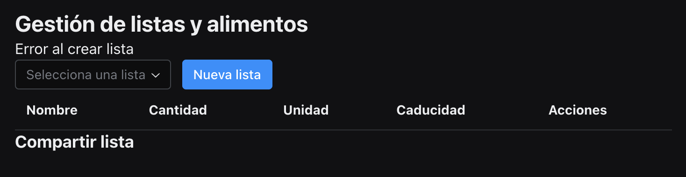

> Detalla en esta sección los prompts principales utilizados durante la creación del proyecto, que justifiquen el uso de asistentes de código en todas las fases del ciclo de vida del desarrollo. Esperamos un máximo de 3 por sección, principalmente los de creación inicial o  los de corrección o adición de funcionalidades que consideres más relevantes.
Puedes añadir adicionalmente la conversación completa como link o archivo adjunto si así lo consideras


## Índice

- [Índice](#índice)
- [1. Descripción general del producto](#1-descripción-general-del-producto)
- [2. Arquitectura del Sistema](#2-arquitectura-del-sistema)
  - [**2.1. Diagrama de arquitectura:**](#21-diagrama-de-arquitectura)
  - [**2.2. Descripción de componentes principales:**](#22-descripción-de-componentes-principales)
  - [**2.3. Descripción de alto nivel del proyecto y estructura de ficheros**](#23-descripción-de-alto-nivel-del-proyecto-y-estructura-de-ficheros)
  - [**2.4. Infraestructura y despliegue**](#24-infraestructura-y-despliegue)
  - [**2.5. Seguridad**](#25-seguridad)
  - [**2.6. Tests**](#26-tests)
- [3. Modelo de Datos](#3-modelo-de-datos)
- [4. Especificación de la API](#4-especificación-de-la-api)
- [5. Historias de Usuario y Tickets de Trabajo](#5-historias-de-usuario-y-tickets-de-trabajo)
- [6. Desarrollo de las Historias de Usuario del proyecto](#6-desarrollo-de-las-historias-de-usuario-del-proyecto)
  - [6.1 Preparación repositorio](#61-preparación-repositorio)
  - [6.2 Commits y releases](#62-commits-y-releases)

---

## 1. Descripción general del producto

**Prompt 1:**

Como experto desarrollador de aplicaciones para móviles, revisa el código del proyecto @Codebase  y crea un solution spec en formato markdown en la carpeta @refactor  siguiendo los estándares para este tipo de documentos, ten en cuenta que este documento será el punto de partida para el personal de negocio, de desarrollo, de infrastructura y de diseño para realizar una refactorización del código fuente de la aplicación

**Prompt 2:**

Perfecto, ahora revisa el @Codebase y rellena el documento con la información que puedas extraer del código fuente y los fiocheros de configuración del mismo

**Prompt 3:**

ahora actúa como desarrollador expero en applicaciones móviles y continúa documentando el proyecto en el @solution_spec.md

**Prompt 4:**

Actúa como un experto en producto de negocio rellenar los apartados 0 y 1 en @readme.md en base a lo indicado en @readme.md , teniendo en cuenta la documentación anterior @solution_spec.md y que el alcance del proyecto debe tener 30 horas de duración para obtener un MVP, si tienes dudas sobre algún punto  sobre el que rellenar pregúntame

**Prompt 5:**

Lee el listado de @alcance.md y modifica el apartado 1 de @readme.md para que el objetivo, características y diseño reflejen lo especificado como características del proyecto

**Prompt 6:**

Como experto arquitecto de software, necesito que crees un diagrama mermaid que represente el funcionamiento del proyecto a día de hoy según @solution_spec.md

**Prompt 7:**

Como arquitecto de software experto en refactorización, con conocimientos en @Doc_AngularJS @Doc_Angular @Ionic Framework @Firebase @Sign in with Apple @Google Sign-In @Reflex @Django PWA @Django @Flask @Python 3 Javascript y Typescript, revisa el código del proyecto, el fichero @solution_spec.md y el apartado '2.1. Diagrama de arquitectura:(actual)' y previos del documento @readme.md para realizar una propuesta de refactorización, en un documento markdown en la carpeta @refactor, del código del proyecto teniendo en cuenta lo descrito en @alcance.md, el objetivo princiopal es reescribir el proyecto para traerlo a la úlñtima versiñón de un framework y convertirlo de app para dispositivos a PWA responsive

**Prompt 8:**

antes de continuar, revisando la propuesta con el equipo de desarrollo, expertos en python con algunos conocimientos de Angular e ionic, y teniendo en cuenta la idea de añadir un agente de IA en el proyecto, arguménta porqué no reescribirlo todo en Python

**Prompt 9:**

antes de continuar, revisando la propuesta con el equipo de desarrollo, expertos en python con algunos conocimientos de Angular e ionic, y teniendo en cuenta la idea de añadir un agente de IA en el proyecto, arguménta porqué no reescribirlo todo en Python

**Prompt 10:**

Si, realiza una comparativa de costes para incluirla en el documento de propuesta, pero el equipo de desarrollo ha evaluado Supabase por su lado y prefiere que esta sea la opción para la arquitectura, adapta la propuesta de refactorización enfocándote en esta opción y teniendo en cuenta esto que han encontrado los desarrolladores  @Supabase Python y la documentación de @Supabase

**Prompt 11:**

Amplía la propuesta con ejemplos de uso de supabase-py y @https://medium.com/@rohitverma_69543/harnessing-the-power-of-supabase-in-python-with-supabase-py-03f36a97c482  el frontend debería también ser reescrito con Python, y con la información relevante de estas páginas, pues lo que proponen será tenido en cuenta en el proyecto, si tienes que adaptar la propuesta hazlo @https://supabase.com/blog/sql-or-nosql-both-with-postgresql @https://supabase.com/docs/guides/getting-started/ai-prompts

**Prompt 12:**

Actualiza el proyecto de propuesta y crea también un fichero de log, en formato markdown con fecha y hora, que registre toda esta conversación y un documento markdown de resumen para saber cómo hemos llegado a la propuesta definitiva

---

## 2. Arquitectura del Sistema

### **2.1. Diagrama de arquitectura:**

**Prompt 1:**

Como experto arquitecto de software, necesito que crees un diagrama mermaid que represente el funcionamiento del proyecto a día de hoy según @solution_spec.md

**Prompt 2:**

@readme.md añade un apartado '### Explicación' en el apartado '### **2.1.2 (objetivo)**' que explique el diagrama igual que en el apartado '### **2.1.1 (actual)**'

### **2.2. Descripción de componentes principales:**

**Prompt 1:**

En base a @propuesta_refactorizacion.md, @solution_spec.md  y lo escrito ya en el fichero @readme.md incluye una descrpción técnica muy resumida de los componentes principales del proyecto, en el apartado '### **2.2. Descripción de componentes principales:**', cada componente debe definir la tecnología utilizada actualmente en el proyecto y la tecnología objetivo que debe utilizar, si puedes incluye algún ejemplo o referencia

### **2.3. Descripción de alto nivel del proyecto y estructura de ficheros**

**Prompt 1:**

En base a @propuesta_refactorizacion.md, @solution_spec.md  y lo escrito ya en el fichero @readme.md incluye una descrpción técnica muy resumida del proyecto, en el apartado '### **2.3. Descripción de alto nivel del proyecto y estructura de ficheros**', unas 4 o 5 líneas, y un diagrasma mermaid de la estructura de ficheros. Debes escribir dos apartados, uno con al situación actual y otro con la situación objetivo, como se ha hecho en '### **2.1. Diagrama de arquitectura:**'

### **2.4. Infraestructura y despliegue**

**Prompt 1:**

En base a @propuesta_refactorizacion.md, @solution_spec.md  y lo escrito ya en el fichero @readme.md incluye una descrpción técnica de la infrastructura del proyecto, en el apartado '### **2.4. Infraestructura y despliegue**', debes definir y crear un diagrama de infraestructura en formato mermaid válido la infraestructura utilizada actualmente en el proyecto y la infraestructura objetivo que debe utilizar, incluye también una explicación de cómo realizar despliegues en cada uno de los casos

### **2.5. Seguridad**

**Prompt 1:**

En base a @propuesta_refactorizacion.md, @solution_spec.md  y lo escrito ya en el fichero @readme.md, habla con los expertos en seguridad e incluye los requisitos y elementos de seguridad proyecto, en el apartado '### **2.5. Seguridad**', incluye y enumera las prácticas de seguridad principales implementadas actualmente en el proyecto y objetivo que se deban implementar

### **2.6. Tests**

**Prompt 1:**

En base a @propuesta_refactorizacion.md, @solution_spec.md  y lo escrito ya en el fichero @readme.md, habla con QA e incluye lostests definidos en el proyecto, en el apartado '### **2.6. Tests**', haz una breve descripción de los casos de uso actuales del proyecto, y detalla más en profundidad los tests y los casos de uso con formato gherkin para el objetivo del proyecto

---

## 3. Modelo de Datos

**Prompt 1:**

Actúa como experto en bases de datos @Postgres y con conocimientos en @Firebase @Ionic Framework @Supabase Python revisa el proyecto en base a @propuesta_refactorizacion.md, @solution_spec.md  y lo escrito ya en el fichero @readme.md, genera un diagrama en formato mermaid con el modelo de datos actual del proyecto y con un modelo de datos en base al objetivo del proyecto

**Prompt 2:**

Perfecto, amplía los dos diagramas en formato mermaid y añade todos los parámetros que permite la sintaxis para dar el máximo detalle, por ejemplo las claves primarias y foráneas. También revisa el formato markdown del documento @readme.md y dame una descripción con el máximo detalle de cada entidad, como el nombre y tipo de cada atributo, descripción breve si procede, claves primarias y foráneas, relaciones y tipo de relación, restricciones (unique, not null…), etc.

---

## 4. Especificación de la API

**Prompt 1:**

Actúa como experto en desarrollo backend de APIs con @Supabase @Supabase Python @Python 3 revisa el proyecto en base a @propuesta_refactorizacion.md, @solution_spec.md  y lo escrito ya en el fichero @readme.md, de ser necesaria una API en el objetivo del proyecto, describe los endpoints principales de la API  en formato OpenAPI con el mayor nivel de detalle posible. Sigue las buenas prácticas estándar de diseño de APIS, usa la metodología DDD y sigue los principios SOLID y DRY

**Prompt 2:**

Perfecto, los desarrolladores, tanto frontend como backend, piden que se especifiquen ejemplos de la API, así como una manera más sencilla y visual para verla, recomienda la mejor manera, y habrá que especificar, para el desarrollo y las pruebas, una forma de trabajar con mocks tanto para frontend como para backend

---

## 5. Historias de Usuario y Tickets de Trabajo

**Prompt 1:**

Actúa como experto analista de negocio que está teniendo conversaciones con el cliente y el product owner revisando los documentos @alcance.md@solution_spec.md  @propuesta_refactorizacion.md @readme.md para:
- definir un PRD en un documento markdown en la carpeta @analisis
- definir un Diagrama C4 que llegue en profundidad a los componentes del sistema, un documento markdown en la carpeta @analisis
- definir una planificación a largo plazo en base a los documentos creados y existentes, un documento markdown en la carpeta @analisis
- definir las Historias de Usuario, agrupándolas en Épicas funcionales, guárdalas en una carpeta que se llame backlog (créala si no ecxiste dentro de la carpeta @analisis, cada una en un documento markdown, con el formato siguiente:
```
Título de la Historia de Usuario:

Como [rol del usuario],
quiero [acción que desea realizar el usuario],
para que [beneficio que espera obtener el usuario].

Criterios de Aceptación:
[Detalle específico de funcionalidad]

Notas Adicionales:
[Cualquier consideración adicional]

Historias de Usuario Relacionadas:
[Relaciones con otras historias de usuario]
```
- definir el backlog para el proyecto, priorizando las historias de usuario generadas en base a MoSCoW
- define, para cada historia de usuario, los tickets de trabajo o subtareas sobre la historia de usuario, aterrízalos a nivel técnico, los perfiles técnicos particiopantes necesarios aportan su visión en este apartado, incluso agrúpalos para los diferentes pefiles técnicos, siendo la salida de una reunión de planificación y refinamiento
- Para cada ticket de trabajo debes dar una estimación según la metodología de tallas de camiseta, aquí deberías tomar el rol de los diferentes perfiles técnicos en que hayas agrupado los tickets de trabajo. agrúpa toda la información en un fichero markdwon por cada historia de usuario enriquecido con diagramas mermaid si es necesario, en la misma carpeta que esté el backlog

**Prompt 2:**
Actuando como equipo de desarrollo completo, desarrollador backend, frontend, arquitecto de software, analista de negocio, QA y DevOps, revisa las HU definidas en  @backlog  y realiza el refinamto y correcciones necesarias en base a lo que se describe en @readme.md y @propuesta_refactorizacion.md
Debes revisar también la priorización  @BacklogPriorizado.md y planificación @PlanificacionLargoPlazo.md @PlanificacionReleasesRoadmap.md en base a que el tiempo de desarrollo no debe superar las 30H, pero no elimines historias de usuario, simplemente marca cuales entran en el MVP a realizar en ese tiempo, ten en cuenta que tiene que ser funcional y estar desplegado en @Supabase en base a estándares

**Prompt 3:**

Prepara los issues/tareas en formato markdown, modifica lo necesario en la carpeta @backlog y luego empieza creando lo necesario, revisa si hay una tarea para ello y sino créala o priorizala, para arrancar en local y desplegar en Supabase, @Supabase , y Vercel,  @Vercel, el proyecto con un 'Hola Mundo' sobre el que luego trabajaremos las siguientes historias de usuario, obviamente deberás crear la nueva estructura de carpetas y ficheros necesarios para este ejemplo y deberás documentar los pasos relevantes en el fichero @README.md

**Prompt 4:**

Vamos a hacer un CRUD completo sobre la talba 'productos', y mostrarlo de forma responsive en pantalla, fíjate en lo declarado en @supabase y en @frontend , si consideras que hay que reordenar o renombrar algo en las carpetas y/o ficheros, hazlo

**Prompt 5:**

vale, ahora, en un documento markdown aparte en @refactor, similar a @proceso_discusion_propuesta.md dame el proceso llevado a cabo en esta conversación para la elección de la arquitectura final, detalla el proceso con los problemas encontrados y lo que nos ha llevado a tomar la decisión final

---

## 6. Desarrollo de las Historias de Usuario del proyecto

> Cada prompt será enlazado con el commit o release correspondiente, que se documentará para seguimiento del avance del proyecto tanto el el fichero [readme.md](readme.md) como en el [CHANGELOG.md](CHANGELOG.md) del proyecto.
> Ejemplo de log de commit:
> **Commit [N](8):**
>   - **Descripción:**
>   - **Cambios:**
>   - **Release:** [0.0.1](https://github.com/DanielContrerasAladro/AI4Devs-finalproject/releases/tag/0.0.1) o No genera release

---

### 6.1 Preparación repositorio

> **Prompt 1:**
> Como experto en @https://www.conventionalcommits.org/en/v1.0.0/#summary @GitHub Actions y commits en github, prepara el proyecto para que rellene el fichero @CHANGELOG.md al hacer un commit con el formato que tiene ahora mismo con el nuevo commit al principio del fichero, así como el fichero @readme.md con el commit en el mismo formato y en el apartado '## 6. Commits y Releases', a continuación del último commit, al final del fichero

> **Prompt 2:**
> Que falta por configurar para que @pre-commit se ejecute? Debes indicarme cómo:
> - ejecutar pre-commit de forma automática al hacer un commit
> - como probarlo de forma manual

### 6.2 Commits y releases

> **Prompts Commit [feat(hu3_hu4): estilos y comportamiento de crud de listado de elementos](https://github.com/DanielContrerasAladro/Alacena/commit/b9de33ccd3d41ef47b6c192bb5f898d92497d5ef):**
>
> **Prompt 1:**
> Como equipo de desarrollo compuesto por:
> - DevOps experto en @Reflex-hosting @Firebase @Sign in with Apple @Google Sign-In y buenas prácticas en arquitecturas Free
> - Backend developer experto en @Supabase Python @Python 3 @NodeJS y buenas prácticas de desarollo de APIs
> - Frontend developer experto en @Doc_Angular @Ionic Framework @Reflex y buenas prácticas de Progressive Web Apps
> - Diseñador experto en @Tailwind CSS y buenas prácticas en aplicaciones responsive
>
> Necesito que prioricéis el @BacklogPriorizado.md para empezar con la gestión de productos de Alacena.@HU_3.md , y la Visualización de inventario, @HU_4.md , en base a lo desarrollado previamente en @src
>
> Tras esta priorización y dejarlo reflejado en los ficheros necesarios de @analisis y @backlog , empecemos con la primera Historia de Usuario 'Must Have' del MVP definido
>
> **Prompt 2:**
> Comienza con ambas tareas, no olvides que la funcionalidad debe ser la misma que la desarrollada previamente en la carpeta @src para el frontend y @functions para el backend
> Además, para el diseño, puedes revisar @https://chonyfrikadas.blogspot.com/2016/03/alacena-tu-nueva-app-para-gestion.html
>
> **Prompt 3:**
> Vamos a empezar por reflejar el plan en los tickets de trabajo, en los ficheros de las Historias de usuario correspondientes en @backlog, y después seguiremos este orden:
> - Frontend y diseño, trabajando codo con codo para crear la parte visual y poder revisarla lo antes posible
> - Backend y DevOps definiendo el midelo de datos y los endpoints básicos, así como creándolos en Supabase y RLS
> - Frontend y Backend integrando los endpoints en la aplicación
>
> **Prompt 4:**
> Haz ambos cambios, si es necesario reutilizar iconos o textos, revisa @resources @resources_default y @assets para utilizarlos, copiándolos a la nueva estructura de carpetas, si son necesarios
> Genera el código necesario para los componentes descritos, y los HTML que me has mostrado, además, copia los recursos necesarios y textos a la nueva estructura
>
> **Prompt 5:**
> modifica como se muestra y oculta el producto_form en base a lo que se muestra en este ejemplo
> @https://reflex.dev/docs/components/conditional-rendering/
>
>
> Aquí tuve que revisar un par de detalles del código que el agente de IA no resolvía correctamente, como la forma de mostrar y ocultar el formulario, que no era la correcta y algunos detalles de estilo, que era más rápdio tocarlos a mano

> **Prompts Commit [feat(hu3_hu4): estilos y estilos y api correspondiente al modelo de datos definido](https://github.com/DanielContrerasAladro/Alacena/commit/092e22f0bfac770cc02f254a7a89f15c3d6cfc74):**
>
>
> **Prompt 1:**
> Vamos a continuar con el desarrollo de los tickets de trabajo, revisa lo que hay hecho en los ficheros de las Historias de usuario correspondientes en @backlog  y continuemos:
> - Backend y DevOps definiendo el modelo de datos y los endpoints necesarios para todo el proyecto, rervisando lo que había en @functions y lo que se ha definido en @readme.md para la refactorización, así como creándolos en Supabase y RLS, teniendo en cuenta que la PoC @main.py ya tiene conexión con la base de datos de SupaBase, se podrá reutilizar algo del código allí tgenerado
> - Frontend y Backend integrando los endpoints en la aplicación, aquí vamos a ir revisando la PoC @main.py pues ya está conectada con el backend de SupaBase para reutilizar el código allí creado
> Antes de editar los ficheros infórmame de cuales son los cambios a realizar para validarlos y al terminar registra los pasos realizados en los ficheros de la historia de usuario correspondiente
>
> **Prompt 2:**
> Vamos por el orden en el que has indicado los pasos, crea el microservicio adicional que comentas, aunque solo devuelva OK, pues nos podrá ser útil en el futuro
>
> **Prompt 3:**
> Valido los cambios salvo una cosa, en el RLS debe ser fléxible para que los usuarios puedan compartir sus listas con otros usuarios. Esto me lleva a corregir el modelo de datos en @readme.md ya que faltan las listas del usuario, que puede crear las que necesite, con el nombre que quiera, que contienen distintos alimentos (por ejemplo, nevera, armario, congelador....) aparte de una lista especial que es la lista de la compra
>
> **Prompt 4:**
> Corecto, vamos a reflejar estos cambios, recuerda reflejar el modelo completo en los SQL y en los endpoints

> **Prompt 5:**
> Correcto, continúa con los siguientes pasos y refléjalo en los ficheros correspondientes en la estructura de carpetas, el SQL para SupaBase también debe guardarse como fichero
>
> **Prompt 6:**
> Todo correcto para continuar, salvo dos cosas:
> - Los endpoints de SupaBase deben reflejarse en @supabase_api.py
> - Los cambios para el frontend, debes realizarlos basándote en el estilo y funcionamiento de @inventory.py para el frontend y en @main.py para la conexión con la API de SupaBase en el backend
>
> **Prompt 7:**
> Revisa bien los tipos de datos, notaciones de funciones, definición de páginas.....en base a @Reflex pues hay errores
> en la implementación al ejecutarla
>
>     Tras un par de cambios en el código, para mantener la Proof of Concept (PoC) en funcionamiento, vamos a corregir el funcionamiento dado de la aplicación para seguir con el desarrollo de la aplicación, y que no se rompa la PoC, pues sirve para experimentar y aprender a usar la API de SupaBase, y el resto de la aplicación
>
> **Prompt 8:**
> Funciona, pero en @lists.py me da un error al intentar crear una lista, mira el pantallazo 
> En @inventory.py tenemos funcionando la PoC para crear productos, sin tocar la PoC, revisa que @lists.py funciuone correctamente y de forma similar tanto con el backend como con la UI
> Antes de tocar nada, haz el plan de acción y explícame todos los cambios que vas a realizar en los ficheros
>
> **Prompt 9:**
> Sí, implementa estos cambios añadiendo para el usuario_id un usuario que se recoja del .env del proyecto, para ser usado sólo en ejecución local, más adelante implementaremos el regisrtro y login del usuario

> **Prompts Commit [feat(hu1_hu2_hu5): reestructuracion codigo, tests unitarios, y login completo]((https://github.com/DanielContrerasAladro/Alacena/commit/cae233d092bdbe6f3940eae337f27a72f9e85775)):**
>
>
> **Prompt 1:**
> Comencemos con la implementación de login, añádelo aquí @frontend.py del mismo modo que está añadido 'alacena()' y crea un módulo simple y separado para hacer el login.
> Para el login, como experto en @[Google Sign-In @Sign in with Apple](https://supabase.com/docs/guides/auth/auth-identity-linking?queryGroups=language&language=python#manual-linking-beta) y @https://supabase.com/docs/guides/auth vamos a prepararlo para aceptar el login social y por email, siguiendo las buenas prácticas de @Reflex y @Supabase @Supabase Python
> Recuerda revisar @backlog y @readme.md para preparar la implementación
>
> **Prompt 2:**
> Ahora vamos a
> - integrar el flujo de usuario autenticado en el resto de la app, las llamadas a la API según corresponda
> - gestionar el token JWT tras el login, para estar logado cuando vuelva a entrar desde el mismo dispositivo o navegador, recuerda que estamos creando una PWA
>
> **Prompt 3:**
> ahora que tenemos una parte funcional con login, con frontend, con backend
> el equipo de desarrollo mencionado previamente ha decidido reestructurar el código siguiendo las best practices para hacerlo modular, escalable y legible, además de implementar los tests unitarios necesarios para, a partir de ahora, acometer las historias de usuario utilizando TDD
>
> **Prompt 4:**
> Revisa las historias de usuario y el la planificación en @analisis para actualizar los tickets de trabajo en los que hemos avanzado en esta sesión y reflejarlo en los fichertos correspondientes

> **Prompts Commit [docs: documentos de análisis, planificación y primera definición de historias de usuario redefinidos tras primer sprint](https://github.com/DanielContrerasAladro/Alacena/commit/7ee9135c2e7603a32336873f158fdc7581a42948):**
> Como me gusta ser ordenado, y tenemos una primera versión que despliega en producción y funciona, he hecho una revisión de lo que no está bien, falta por implementar y no se ha tenido en cuenta en el primer análisis y planificación, y he creado un listado de tareas pendientes, que se pueden ver en @HU_MVP.md, y he juntado de nuevo al equipo para analizarlo y planificar las tareas pendientes, reflejarlo en los ficheros correspondientes y crear un diagrama de seguimiento del proyecto
>
>
> **Prompt 1:**
> Como equipo experto en el proyecto actual, revisa las historias de usuario en @analisis y lo escrito en @HU_MVP.md, que contiene ajustes que hay que hacer y tareas pendientes en el proyecto, en el código existente en @frontend , revisando lo que ya se hizo en su día en @src y @functions
> En esta revisión deberás:
>
> - Reflejar tickets de trabajo pendientes en las histoprias de usuario, refléjalo ewn los ficheros markdown correspondientes
> - Si hay que crear historias de usuario nuevas, recuerda que sea en formato gherkin, sigue la secuencia para crear el fichero markdwon en @backlog
> - Actualiza el @BacklogPriorizado.md @BacklogPriorizado.md @ChecklistAnalisis.md @PlanificacionReleasesRoadmap.md
> - Crea un diagerama estándar en seguimientop de proyectos, en formato markdwon, que permita ver el estado actual del proyecto
> - Al priorizar, con MoSCow, la priorización debe tener en cuenta el orden de @HU_MVP.md, se debe resolver primero lo que indica ese fichero y en el orden en que lo indica
>
> **Prompt 2:**
> Actúa como un equipo de desarrollo con FE, BE, QA, PO y BA y planifica los siguientes sprints para llevar a cabo el proyecto completo según @BacklogPriorizado.md
> Debéis estimar las tareas con tallas de camisetay actualizar @PlanificacionReleasesRoadmap.md
> Actualiza los ficheros necesarios de las historias de usuario dentro de @backlog

> **Prompts Commit [feat(hu_3): Gestión de productos completa con validaciones, feedback y tests](https://github.com/DanielContrerasAladro/Alacena/commit/fe9974f0564546ae4dbb2a57aa1dcbfc1ffda9d0):**
>
>
> **Prompt 1:**
> Como equipo de desarrollo compuesto por:
> - DevOps experto en @Reflex-hosting, @Supabase  y buenas prácticas en arquitecturas Free
> - Backend developer experto en @Supabase Python @Python 3 @NodeJS y buenas prácticas de desarollo de APIs
> - Frontend developer experto en @Doc_Angular @Ionic Framework @Reflex y buenas prácticas de Progressive Web Apps
> - Diseñador experto en @Tailwind CSS y buenas prácticas en aplicaciones responsive
> - QA tester experto en @Pytest y buenas prácticas de testing y validación de requisitos
>
> Hay arrancar el siguiente sprint revisando @BacklogPriorizado.md y @Resumen_Sprints_Responsables.md , además de los documentos de @refactor para continuar con el desarrollo de la funcionalidad definida en las historias de usuario, empezar por los detalles pendientes de HU_3, HU_4 y HU_12 como se indica en @BacklogPriorizado.md
>
> Se seguirán buenas prácticas en arquitectura, en patrones de desarollo Backend, modelo de desarrollo TDD y que cada hito que se resuelva quede documentado en los ficheros de seguimiento en @analisis
>
> ---
>       Tras una conversación en la que se va avanzando test a test y funcionalidad a funcionalidad, terminamos con la HU_3
> ---
>
> **Prompt 2:**
> Antes de continuar con la siguiente historia de usuario, vamos a documentar el hito para hacer commit y desplegar en producción los cambios
> Documenta directamente en los ficheros makrdown correspondientes
> Actualiza también @Resumen_Sprints_Responsables.md @PlanificacionReleasesRoadmap.md @BacklogPriorizado.md

> **Prompts Commit [feat(hu_4): migración a modelo simplificado de alimentos con lista_id y refactor integral](https://github.com/DanielContrerasAladro/Alacena/commit/e584693787d760af11994046567107ad5aee7e2d):**
>
>
> **Prompt 1:**
> Sí, vamos a avanzar con la siguiente historia de usuario, te recuerdo el equipo de desarrollo y las directrices
>
> - DevOps experto en @Reflex-hosting, @Supabase  y buenas prácticas en arquitecturas Free
> - Backend developer experto en @Supabase Python @Python 3 @NodeJS y buenas prácticas de desarollo de APIs
> - Frontend developer experto en @Doc_Angular @Ionic Framework @Reflex y buenas prácticas de Progressive Web Apps
> - Diseñador experto en @Tailwind CSS y buenas prácticas en aplicaciones responsive
> - QA tester experto en @Pytest y buenas prácticas de testing y validación de requisitos
>
> Se seguirán buenas prácticas en arquitectura, en patrones de desarollo Backend, modelo de desarrollo TDD y que cada hito que se resuelva quede documentado en los ficheros de seguimiento en @analisis
>
>  **Prompt 2:**
> Comienza por los tests, vamos por el orden que has marcado, solo ten en cuenta estas correcciones para realizar las implementaciones correspondientes
> - Aqui 'El usuario debe ver una lista clara y ordenada de todos los productos de su alacena.' los productos se agrupan por listas, luego si hay que modificar algo en backend o frontend para ello, es el momento de hacerlo
> - Aqui 'Se muestran detalles: nombre, cantidad, unidad y fecha de caducidad.' se debe mostrar también un icóno que identificará la categoría del producto, que podrán tener el nombre que el usuario desee, y escoger entre los iconos de @icons
>
> ---
>     Tras una conversación en la que se va avanzando test a test y funcionalidad a funcionalidad, detectamos una anomalía en el desarrollo de la HU_4
> ---
>
>  **Prompt 3:**
> Cuando intento crear un nuevo producto, con la nueva lógica, que los productos tienen que estar asociados a una lista, sale el siguiente error
> ```
> Error al crear producto en Supabase: {"code":"PGRST204","details":null,"hint":null,"message":"Could not find the 'lista' column of 'productos' in the schema cache"}
> ```
> Revisa los scripts de @supabase la api @api para corregir el error, recuerda seguir las buenas prácticas de las tecnologías y seguir TDD, y la documentación acerca de la base de datos, @README.md y @refactor  para que cumpla este nuevo requisito en la refactorización objetivo del proyecto
>
> ---
>       Tras una conversación en la que se va avanzando test a test y funcionalidad a funcionalidad, terminamos con el desarrollo de la HU_4
> ---
>
> **Prompt 4:**
> Antes de continuar con la siguiente historia de usuario, vamos a documentar el hito para hacer commit y desplegar en producción los cambios
> Documenta directamente en los ficheros makrdown correspondientes
> Actualiza también @Resumen_Sprints_Responsables.md @PlanificacionReleasesRoadmap.md @BacklogPriorizado.md

> **Prompts Commit [feat(@lists): cierre y despliegue de HU_13, HU_14, HU_15, HU_16, HU_17, HU_18, HU_19 Todas las historias de usuario del bloque @lists (HU_13 a HU_19) marcadas como `Hecho` y documentadas como completadas y desplegadas en producción. Internacionalización completa, robustez en el manejo de listas y alimentos, y corrección de errores de linter y argumentos en botones. Actualización de los ficheros de backlog, resúmenes y roadmap para reflejar el hito alcanzado. Tests unirtarios y de integración para las nuevas funcionalidades añadidas.](https://github.com/DanielContrerasAladro/Alacena/commit/5e575d97362ab07a74e7c615cddaf3a80681a3c6):**
>
>
> **Prompt 1:**
> Tras lo desarrollado hasta ahora, hay que revisar este error de concepto, al dar de alta un segundo alimento para la misma lista, igual hay que cambiar la relación entre alimentos y alimentos_listas, la tabla alimentos tiene los alimentos que están en las listas, puede estar en varias listas con distintos valores, la tabla productos tendrá una relación de alimentos única, una fila por alimento, con su categoría, que será una tabla distinta con el nombre de la categoría y el icóno del mismo.
> Revisa para esto lo que ya se desarrolló en @src y @functions para corregir este error de concepto en @frontend
> No olvides que disponemos de un squad de desarrollo compuesto por:
>
> - DevOps experto en @Reflex-hosting  , @Supabase  y buenas prácticas en arquitecturas Free
> - Backend developer experto en @Supabase Python @Python 3 @NodeJS y buenas prácticas de desarollo de APIs
> - Frontend developer experto en @Doc_Angular @Ionic Framework @Reflex y buenas prácticas de Progressive Web Apps
> - Diseñador experto en @Tailwind CSS y buenas prácticas en aplicaciones responsive
> - QA tester experto en @Pytest y buenas prácticas de testing y validación de requisitos

>Empecemos analizando el problema y buscando la solución entre todos, si se necesita feedback de alguno de los roles, pregúntame de forma ordenada y lo resolveremos paso a paso
>Se seguirán buenas prácticas en arquitectura, en patrones de desarollo Backend, modelo de desarrollo TDD y que cada hito que se resuelva quede documentado en los ficheros de seguimiento en @analisis
>
> **Prompt 2:**
> Voy a responder a las preguntas y vamos empezar por el siguiente orden para empezar a desarrollar las modificaciones: Backend, Frontend, Diseño, QA, DevOps
> 1. DevOps
> ¿Alguna consideración especial para la migración de datos y despliegue en Supabase? Sigamos los estándares de la plataforma
> ¿Recomendaciones para mantener la integridad y performance en el modelo N:M? No es necesario, con el modelo de datos especificado es suficiente
> 2. Backend
> ¿Validamos la estructura propuesta? Si
> ¿Algún patrón de API REST recomendado para exponer alimentos por lista y productos únicos? Sigue los estándares para una API Rest
> ¿Cómo versionar la migración y mantener backwards compatibility durante el cambio? Usa los patrones estándar de Supabase para la base de datos
> 3. Frontend
> ¿Qué cambios serían necesarios en la lógica de consulta y visualización de alimentos por lista? La lógica es correcta, solo ajustar con el nuevo modelo para presentar los datos y hay que revisar que se carguen los alimentos de una lista al inicio de la aplicación, de la primera lista que se obtenga al obtener las listas del usuario. Además de que se podrá usar la lista de productos para hacer un predictor de texto en la caja de texto que permita escribir el nombre al añadir un nuevo elemento
> ¿Cómo se gestionará la selección de productos únicos y su asociación a listas? los productos únicos no se borrarán aunque desaparezcan de todas las listas
> 4. Diseño
> ¿Alguna recomendación para la visualización de categorías e iconos en la UI? La categorías se crea con nombre y un icono de la carpeta @icons , habrá una pantalla específica para editar, crear o borrar, aqui tienes un ejemplo de como eran las categorias en el desarollo anterior @Categories.json
> ¿Cómo mostrar de forma clara la distinción entre productos únicos y alimentos en listas? en las listas solo se ven los alimentos, los productos únicos guardados servirá para indicar la categoría de un alimento y el nombre, se podrá editar en una página aparte que también permitirá borrar, solo se crearán productos en la tabla de productos cuando se de de alta un nuevo alimento en una lista, pero si al crear un elemento en una lista ya existe (se buscará si existe por nombre) se cogerá la categoría para darlo de alta
> 5. QA
> ¿Qué casos de test y validación deberíamos cubrir para asegurar la integridad del nuevo modelo? Los tests unitarios siempre
> ¿Cómo versionar los tests para no perder cobertura durante la migración? No importa, podemos considerar esto como un breaking change
>
> ---
>       Tras una conversación en la que se tuve que salir de un bucle con errores de compìlación que se rompía por un lado y al arreglarlo generaba otro error, y al arreglar este volvíamos al primero, tuve que probar distintos modelos de LLM para arreglarlo, con distintas conversaciones, para al final romper el bucle y solucionarlo, se llegó a la solución y se avanzó en el desarrollo de la HU_4
> ---
>
> **Prompt 3:**
> ahora hay que revisar @i18n para que set_lang esté en ese módulo y no en ProductState
> - los ficheros con los términos traducidos para utilizar en los layouts están aqui @i18n que al compilar se trasladarán aqui @i18n
> - hay que revisar esos ficheros y los textos que se muestran en pantalla, sean botones, nombres de columnas, nombres de campos, ejemplos, mensajes de error o éxito para que todo se traduzca, si tienes dudas de qué mensaje utlizar de los ficheros json, preguntame
> - hay que tener en cuenta la documentación de @Reflex-hosting para que al llevarlo a producción funcione correctamente

> **Prompts Commit [feat: Refactor global con integracion IA y limpieza](https://github.com/DanielContrerasAladro/Alacena/commit/3b998a2c117f9a814bc193121723f3fcb9580269):**
>
> **Prompt 1:**
> @HU_23_autorrelleno_lista.md @HU_24_ia_recetas.md @HU_25_menus_semanales_ia.md Hay que revisar estas tres HU pues que hay cosas a tener en cuenta, para ello vamos a incorporar un nuevo miembro al equipo, un AI Engineer, pues en estas tres HU, que son el objetivo prioritario del siguiente sprint, hay que incluir agentes con IA para acometer las features solicitadas
>
> Con el equipo formado por :
> - DevOps experto en @Reflex-hosting  , @Supabase  y buenas prácticas en arquitecturas Free
> - Backend developer experto en @Supabase Python @Python 3 @NodeJS y buenas prácticas de desarollo de APIs
> - Frontend developer experto en @Doc_Angular @Ionic Framework @Reflex y buenas prácticas de Progressive Web Apps
> - Diseñador experto en @Tailwind CSS y buenas prácticas en aplicaciones responsive
> - QA tester experto en @Pytest y buenas prácticas de testing y validación de requisitos
> - AI Engineer experto en Agentes de IA, @LlamaAI @LlamaAILearn @LlamaAgents @LlamaAIAPI @LangGrapgh @LangChain @LangSmith @LangGraphPlatform @LangGraphStudio @LangFlow @SupaBaseMCP @MCPSO @BrowserAgentDesk @DeepSeekAPI @DeepSeekAIAgentsTut @DeepSeekMCPServerTut @CrewAI @AutoGen
>
> Empecemos analizando las características de las tres HU teniendo en cuenta:
>
> - Un agente IA orquestador que organice el trabajo del resto de agentes y permita la interacción con el usuario mediante un chat en la propia aplicación, manteniendo un histórico de conversaciones y centralizando la comunicación con el usuario
> - Un agente autónomo de IA que sea experto en nutrición al que poder darle instrucciones espeecíficas por usuario para generar menús semanales saludables, sugerir platos rápidos para la comida o la cena según los alimentos registrados en la aplicación
> - Un agente autónomo de IA que permita hacer un seguimiento de lo comido y comunique con el agente experto en nutrición, o sea el mismo (esto hay que evaluarlo), para estudiar los hábitos de alimentación y recomendar mejoras según objetivos definidos (pérdida de peso, reducción de azuar, mejora de energía...)
> - Un agente autónomo IA que revise los menús, tanto si son generados como registrados por el usuario, para ir actualizando la lista de alimentos registrados en la aplicación y la lista de la compra en consecuencia, también actualizará la lista de la compra si el usuario va eliminando o reduciendo las cantidades de las otras listas, así como ser el encargado de avisar al usuario, via email, de las caducidades de los alimentos según se vayan acercando las fechas, con posibilidad de personalización por parte del usuario
> - Buscar soluciones cloud escalables y de bajo coste, si son gratuitas o ejecutables dentro de la aplicación o en un hosting propio, ya tenemos @Supabase, mejor
> - Estudiar la creación de un servidor MCP con información y conocimiento útil para los tres agentes, o incluso un LLM refinado, o una base de datos RAG, que se alimente y aprenda con ese MCP server, revisar con el experto estas opciones y su viabilidad
>
> Según estos criterios quizá haya que tener en cuenta, o se desarrollen al mismo tiempo, algunos aspectos de otras HU de @backlog , revisarlo como equipo para tenerlo en cuenta y reflejarlo en las relaciones entre las distintas HU
>
> Se seguirán buenas prácticas en arquitectura, en patrones de desarollo Backend, modelo de desarrollo TDD y que cada hito que se resuelva quede documentado en los ficheros de seguimiento en @analisis
>
> **Prompt 2:**
> Los siguientes pasos que debes seguir, relizando los cambios necesarios sin esperar confirmación a menos que tengas preguntas necesarias que te impidan continuar:
> - Tests automáticos de los endpoints y de los agentes
> - Integración de IA para los agentes más avanzados
> - Revisar que @microservice debe desplegarse en @Reflex-hosting o @Supabase , evalúa la mejor opción con lo ya configurado en el proyecto
> - El siguiente paso de '5. Siguientes pasos sugeridos para el equipo'
> Trabaja de forma autónoma, escribiendo y creando los ficheros y carpetas necesarias, según el rol del equipo de desarrollo que debas tomar en cada momento, para llevar a cabo los puntos descritos
>
> **Prompt 3:**
> Los siguientes pasos que debes seguir, relizando los cambios necesarios sin esperar confirmación a menos que tengas preguntas necesarias que te impidan continuar:
>
> - Revisión y modificación de @microservice para que sea una arquitectura de funciones serverless (Edge Functions) que permita su despliegue en Supabase
> - Preparación de ejemplos de payloads reales, scripts de despliegue, o documentación para QA y DevOps
> - Avanzar con la integración de un modelo IA real en uno de los agentes
> - El siguiente paso de '5. Siguientes pasos sugeridos para el equipo'
>
> Trabaja de forma autónoma, escribiendo y creando los ficheros y carpetas necesarias, según el rol del equipo de desarrollo que debas tomar en cada momento, para llevar a cabo los puntos descritos
>
> **Prompt 4:**
> Los siguientes pasos que debes seguir, relizando los cambios necesarios sin esperar confirmación a menos que tengas preguntas necesarias que te impidan continuar:
>
> - Revisión y modificación , en caso de ser necesario, de la ubicación de @microservice teniendo en cuenta que el resto del proyecto está en @frontend , ten en cuenta que esta última se despliegua en Reflex, aunque se conecta con Supabase para la base de datos
> - Preparar scripts de automatización para el despliegue de todas las funciones
> - integración de la arquitectura serverless en el backend/orquestador principal
> - Documente el flujo extremo a extremo para el equipo
> - El siguiente paso de '5. Siguientes pasos sugeridos para el equipo'
>
> Trabaja de forma autónoma, escribiendo y creando los ficheros y carpetas necesarias, según el rol del equipo de desarrollo que debas tomar en cada momento, para llevar a cabo los puntos descritos
>
> **Prompt 5:**
> Los siguientes pasos que debes seguir, relizando los cambios necesarios sin esperar confirmación a menos que tengas preguntas necesarias que te impidan continuar:
>
> - Crear guía rápida para desarrolladores sobre cómo añadir nuevas funcioneso agentes
> - Avanzar con la integración directa de las Edge Functions desde el frontend Reflex (sin pasar por backend)
> - Documentar la estrategia de staging/producción y versionado de funciones
> - Avanzar con la integración de un modelo IA real en uno de los agentes
> - El siguiente paso de '5. Siguientes pasos sugeridos para el equipo'
>
> Trabaja de forma autónoma, escribiendo y creando los ficheros y carpetas necesarias, según el rol del equipo de desarrollo que debas tomar en cada momento, para llevar a cabo los puntos descritos
>
> **Prompt 6:**
> Los siguientes pasos que debes seguir, relizando los cambios necesarios sin esperar confirmación a menos que tengas preguntas necesarias que te impidan continuar:
>
> - automatización de rollback/versionado de funciones
> - ejemplos de integración de logs centralizados en el orquestador y agentes
> - Avanzar con la integración de un modelo IA real en uno de los agentes
> - El siguiente paso de '5. Siguientes pasos sugeridos para el equipo'
>
> Trabaja de forma autónoma, escribiendo y creando los ficheros y carpetas necesarias, según el rol del equipo de desarrollo que debas tomar en cada momento, para llevar a cabo los puntos descritos
>
> **Prompt 7:**
> Ahora vamos a revisar, como equipo, qué está hecho, qué queda por hacer, y ordenar los siguientes pasos a seguir de lo definido en @analisis para las HU @HU_23_autorrelleno_lista.md @HU_24_ia_recetas.md @HU_25_menus_semanales_ia.md
> Establecer, como equipo, los siguientes pasos a seguir apartir de ahora
>
> **Prompt 8:**
> Los siguientes pasos que debes seguir, relizando los cambios necesarios sin esperar confirmación a menos que tengas preguntas necesarias que te impidan continuar:
>
> - Preparar los tickets/tareas técnicas para cada punto, refléjalo en cada archivo markdoqwn de las HU
> - una tabla de responsables y fechas objetivo para cada HU
> - implementación de todos los endpoints/backend prioritarios
>
> Trabaja de forma autónoma, escribiendo y creando los ficheros y carpetas necesarias, según el rol del equipo de desarrollo que debas tomar en cada momento, para llevar a cabo los puntos descritos
>
> **Prompt 9:**
> Tenemos que avanzar y experimentar en la integración real entre agentes, estamos montando un Sistema de multiagentes (MAS), por lo que trabaja como AI Engineer experto en @LlamaAI @LlamaAILearn @LlamaAgents @LlamaAIAPI @LangGrapgh @LangChain @LangSmith @LangGraphPlatform @CrewAI @AutoGen @LangFlow para desarrollar los agentes definidos en las HU y permitir que interactúen con @microservice de forma sencilla
> También es necesario, como experto en AI Engineering establecer la forma de testear esos agentes de forma local y evaluar los LLMs, MCP Server, base de datos RAG o LLM Fine Tuning necesarios para utilizar en los agentes del sistema
>
> **Prompt 10:**
> Los siguientes pasos que debes seguir, relizando los cambios necesarios sin esperar confirmación a menos que tengas preguntas necesarias que te impidan continuar:
>
> - Implementa un ejemplo de agente (por ejemplo, inventario) que use LangChain para lógica IA y que lea/escriba datos en Supabase (o SQLite en local)
> - Implementa un ejemplo de agente (por ejemplo, habitos) que use LlamaIndex para lógica IA y que lea/escriba datos en Supabase (o SQLite en local)
> - Prepara una base para que los agentes puedan llamarse entre sí (multiagente) y orquestar flujos desde un orquestador central
> - Documenta cómo estructurar la capa de acceso a datos para que sea compatible tanto con Supabase como con SQLite/mock en local
>
> Trabaja de forma autónoma, escribiendo y creando los ficheros y carpetas necesarias, según el rol del equipo de desarrollo que debas tomar en cada momento, para llevar a cabo los puntos descritos
>
> **Prompt 11:**
> Vamos a dejar de avanzar de momento, lo primero es explorar diferentes opciones de 'llm'
> Veo que en @llamaindex_agent.py y @langchain_agent.py has utilizado OPENAI, lo cual está muy bien pero limitado en cuanto a uso gratuíto de los modelos más modernos
> Quiero que, como AI Engineer, realices un módulo para cargar el LLM que permita cargar distintos LLMs y asi, desde local, poder experimentar con variedad de ellos para ver cuál es el que mejor se ajusta a las necesidades del proyecto, revisa @https://huggingface.co/models, @https://ollama.com/library, @LangGrapgh , @LangChain , @LlamaAgents y @LlamaAILearn para ver la manera de probar estos agentes con diferentes LLM gratuítos, establece un listado de los más populares
>
> **Prompt 12:**
> Intégra el uso de @llm_loader.py en los agentes de ejemplo y rellena el @notebook_llm_experiments.ipynb con los diferentes modelos opensource listados en "Modelos open source populares (2024)" de la manera que se  indica en '1. Módulo llm_loader.py', pues ahora mismo está vacío y debería estar relleno con diferentes ejemplos para experimentar y evaluar el rendimiento de los distintos modelos
>
> **Prompt 13:**
> Los siguientes pasos que debes seguir, relizando los cambios necesarios sin esperar confirmación a menos que tengas preguntas necesarias que te impidan continuar:
>
> - Prepara el @notebook_llm_experiments.ipynb para automatizar benchmarks de varios modelos
> - También en el @notebook_llm_experiments.ipynb , prepara la manera de evaluar creatividad, coste, velocidad y fiabilidad de los distintos LLM para el objetivo de los agentes que tenemosen base a técnicas e machine learning
> - Documenta cómo elegir el mejor modelo LLM según el caso de uso de los agentes definidos en las HU y en @agentes
>
> Trabaja de forma autónoma, escribiendo y creando los ficheros y carpetas necesarias, según el rol del equipo de desarrollo que debas tomar en cada momento, para llevar a cabo los puntos descritos
>
> ***Prompt 14:**
> Añade más prompts ten en cuenta los agentes que estamos desarrollando en @agentes y los objetivos marcados para ellos en las HU, más modelos y gráficas que muestren los resultados para poder compararlos
>
> **Prompt 15:**
> Tras el estudio realizado de los distintos modelos, vamos a modificar @llm_loader.py para que realice la distinción de modelos según el agente que esté llamando (Nutricional, Hábitos, Inventario) con un nuevo parámetro para ello. También debemos asegurarnos, o buscar la manera de estar seguros, que los modelos que se van a usar estén descargados en el lugar que se vaya a ejecutar el agente.
> Los agentes deben seguir el patrón del ejemplo @langchain_agent.py
> Los agentes que vamos utilizar son, y se deberá implementar en los agentes específicos:
> - Nutricional: falcon, cuya temperatura por defecto deberá ser 0.3, refléjalo en @main.py
> - Hábitos: falcon, cuya temperatura por defecto deberá ser 0.1, refléjalo en @main.py
> - Inventario: openhermes, cuya temperatura por defecto deberá ser 0.2, refléjalo en @main.py
>
> **Prompt 16:**
> Ahora, como experto en @Supabase y Supabase Edge Functions, teniendo en cuenta que @/edge_functions debe ser el objetivo final de la funcionalidad de @/microservice , revidsa el contenido de @/edge_functions @/agentes @/fastapi_backend y @/microservice para unificar el código, pero la parte de los agentes con langchain, que se encuentra @/agentes es la que debe prevalecer, si hay que borrar ficheros, dame el listado y lo haré yo, pero si hay que trasladar código, hazlo
>
> **Prompt 17:**
>
> Con este equipo de desarollo:
>
> - DevOps experto en @Reflex-hosting  , @Supabase  y buenas prácticas en arquitecturas Free
> - Backend developer experto en @Supabase Python @Python 3 @NodeJS y buenas prácticas de desarollo de APIs
> - Frontend developer experto en @Doc_Angular @Ionic Framework @Reflex y buenas prácticas de Progressive Web Apps
> - Diseñador experto en @Tailwind CSS y buenas prácticas en aplicaciones responsive
> - QA tester experto en @Pytest y buenas prácticas de testing y validación de requisitos
>
> Debemos hacer un cambio profundo en el código:
>
> - La parte de @/microservice no es correcta pues Supabase no acepta Edge Functions con Python, como el objetivo del proyecto es utilizar sólo código Python, debemos modificar esta parte para que la parte contenida en esa carpeta sea parte del backend contenido en @/frontend para ser desplegable en Reflex. Hay que refactorizar el código para trasladarlo y así poder desplegar esta parte en Reflex, sin perder funcionalidad, modifica lo que sea necesario, si necesitas borrar algo dame la lista y lo haré yo como última tarea
> - Esto llevara a la modificación también de la parte de @/app que acceda a los microservicios, modifica lo que sea necesario
> - Además, hay que revisar el despliegue en reflex para que la parte de backend nueva se despliegue en reflex con la parte frontend y backend correctamente, revisa para ello @deploy y @deploy.yml
>
> **Prompt 18:**
> no es necesario OPENAI_API_KEY pues utilizamos langchain con ollama y modelos llm opensource y free to use, modificalo y documenta los cambios, después, dame la lista completa de archivos y carpetas a eliminar
>
> **Prompt 19:**
> Vamos a proceder on los siguientes pasos:
>
> - Borrado de los archivos no necesarios, dame la lista y yo los borraré
> - Revisión de los agentes para que las peticiones y respuestas queden almacenadas en base de datos, igual el modelo de base de datos sufre modificaciones, revisarlo y aactualizarlo en caso necesario
> - Prueba de la API en local, que apunte a la base de datos desplegada en Reflex
> - Despliegue de la aplicación en Reflex, parte Frontend y parte Backend
> - Revisión de @deploy.yml respecto de @deploy , pues cuando se ejecuta el primero en github actions parece que el despliegue no funciona correctamente
> - tests unitarios para la parte de @/api
> - Inclusión de la api en @/pages para poder llamar a los agentes de la siguente manera:
> -- botones para llamar a los agentes uno a uno, de forma que el botón pase la información necesaria al agente y luego muestre la respuesta del mismo cuando lo tenga
> -- input de texto para poder hablar con el orquestador, el cual interactuará en background con los agentes que considerte necesario para dar una respuesta
> - Documentación ficheros readme y en @/analisis y @openapi.yaml de ser necesario y pertinente
>
> Revisa la documentación necesaria en cada caso, toma el rol del equipo descrito previamente en cada caso y realiza las modificaciones necesarias sin pedir confirmación en cada punto, si tienes dudas antes de empezar uno de los puntos hazme las preguntas necesarias, pero para al terminar cada punto para que pueda revisar la corrección del mismo
>
> ---
>       Tras una conversación en la que se va avanzando en cada uno de esos apartados, documentamos lo conseguido, lo probamos y lo desplegamos en producción
> ---

> **Prompts Commit [N]():**
>
> **Prompt 1:**
>