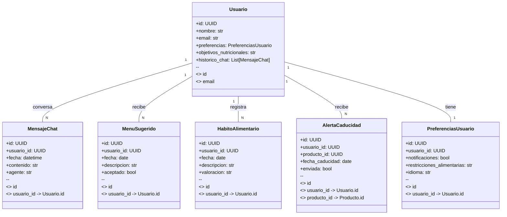

# Diagrama C4 del Sistema de Agentes de IA (Stack Python/Reflex/Supabase)

## 1. Diagrama de Contexto

```mermaid
C4Context
    Person(user, "Usuario", "Gestiona su alacena, menús y listas de la compra, interactúa con agentes IA vía chat")
    Person(admin, "Administrador", "Administra usuarios y configuración global")
    System_Boundary(s1, "Alacena PWA + IA") {
        System(alacena, "Alacena", "Aplicación web progresiva para gestión de despensa, menús y compras (Reflex)")
        System(ia_orq, "Agente Orquestador IA", "Coordina agentes IA y centraliza la comunicación con el usuario")
    }
    System_Ext(ia_nutri, "Agente IA Nutricional", "Genera menús, recetas y recomendaciones personalizadas")
    System_Ext(ia_hab, "Agente IA de Hábitos", "Analiza hábitos alimentarios y recomienda mejoras")
    System_Ext(ia_inv, "Agente IA Inventario/Alertas", "Gestiona inventario, lista de la compra y alertas de caducidad")
    System_Ext(mcp, "Servidor MCP / RAG / LLM", "Base de conocimiento y contexto compartido para los agentes IA")
    System_Ext(email, "Proveedor de Email", "Envía notificaciones y alertas personalizadas")
    System_Ext(iot, "Dispositivos IoT", "Sensores y balanzas conectadas a la alacena")

    user -> alacena : Usa desde navegador
    user -> ia_orq : Interactúa vía chat
    admin -> alacena : Administra
    alacena -> ia_orq : Solicita acciones IA
    ia_orq -> ia_nutri : Solicita menús/recetas
    ia_orq -> ia_hab : Solicita análisis de hábitos
    ia_orq -> ia_inv : Solicita gestión de inventario/alertas
    ia_orq -> mcp : Consulta conocimiento/contexto
    ia_inv -> email : Envía notificaciones
    alacena -> iot : Recibe datos automáticos
```

## 2. Diagrama de Contenedores

```mermaid
C4Container
    System_Boundary(s1, "Alacena PWA + IA") {
        Container(web, "Frontend PWA", "Reflex (Python)", "Interfaz de usuario multiplataforma, chat IA integrado")
        Container(api, "API Backend", "FastAPI (Python)", "Lógica de negocio, autenticación, gestión de datos y orquestación IA")
        Container(db, "Base de Datos", "Supabase/PostgreSQL", "Persistencia de usuarios, productos, menús, listas, histórico de chat")
        Container(ia_orq, "Agente Orquestador IA", "LangGraph/LangChain (Python)", "Orquesta agentes IA, gestiona histórico y contexto de usuario")
        Container(ia_nutri, "Agente IA Nutricional", "LlamaAI/DeepSeek (Python)", "Genera menús, recetas y recomendaciones personalizadas")
        Container(ia_hab, "Agente IA de Hábitos", "LlamaAI/DeepSeek (Python)", "Analiza hábitos alimentarios y recomienda mejoras")
        Container(ia_inv, "Agente IA Inventario/Alertas", "LlamaAI/DeepSeek (Python)", "Gestiona inventario, lista de la compra y alertas de caducidad")
        Container(mcp, "Servidor MCP / RAG / LLM", "SupabaseMCP/LLM propio (Python)", "Base de conocimiento y contexto compartido para los agentes IA")
    }

    user -> web : Interacción UI y chat IA
    web -> api : Solicita datos, operaciones y acciones IA
    api -> db : CRUD entidades, guarda histórico de chat
    api -> ia_orq : Solicita acciones IA y orquestación
    ia_orq -> ia_nutri : Solicita menús/recetas
    ia_orq -> ia_hab : Solicita análisis de hábitos
    ia_orq -> ia_inv : Solicita gestión de inventario/alertas
    ia_orq -> mcp : Consulta conocimiento/contexto
    ia_inv -> api : Solicita envío de notificaciones
    api -> email : Envía notificaciones
    api -> iot : Recibe datos automáticos
```

## 3. Diagrama de Componentes

```mermaid
C4Component
    Container_Boundary(api, "API Backend (FastAPI)") {
        Component(auth, "Autenticación y Autorización", "JWT, OAuth2", "Login, registro, recuperación de contraseña, roles")
        Component(users, "Gestión de Usuarios", "CRUD de usuarios y preferencias")
        Component(pantry, "Gestión de Alacena", "CRUD de productos, movimientos e inventario")
        Component(menus, "Gestión de Menús y Recomendaciones", "Planificación de menús, integración IA")
        Component(shopping, "Gestión de Listas de la Compra", "Generación y gestión de listas de la compra")
        Component(notifications, "Notificaciones", "Gestión y envío de notificaciones")
        Component(chat, "Chat IA Orquestador", "Gestión de histórico, contexto y comunicación con agentes IA")
        Component(openapi, "Documentación OpenAPI", "Generación de documentación Swagger")
    }

    web -> chat : Interfaz de chat IA
    web -> auth : Login/Logout/Registro
    web -> users : Perfil y preferencias
    web -> pantry : Productos y movimientos
    web -> menus : Menús y recomendaciones
    web -> shopping : Listas de la compra
    web -> notifications : Configuración de notificaciones
    chat -> ia_orq : Orquestación de agentes IA
    ia_orq -> ia_nutri : Solicita menús/recetas
    ia_orq -> ia_hab : Solicita análisis de hábitos
    ia_orq -> ia_inv : Solicita gestión de inventario/alertas
    ia_orq -> mcp : Consulta conocimiento/contexto
    ia_inv -> notifications : Solicita envío de alertas
    api -> openapi : Documentación interactiva
    api -> db : Persistencia
```

## 4. Diagrama de Clases (Modelo de Datos IA)


