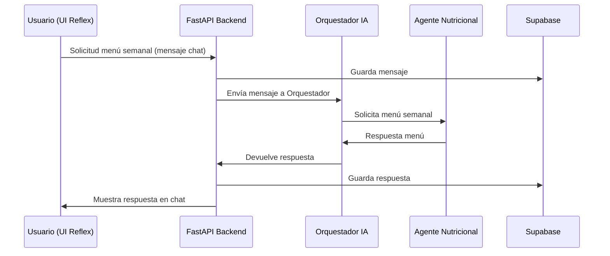
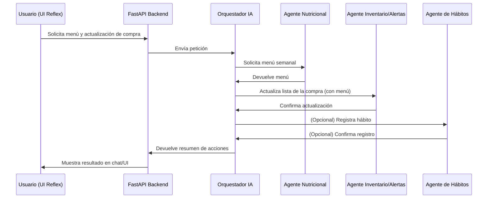

# Flujos de Interacción IA: Usuario, Orquestador y Agentes

Este documento describe los flujos principales de interacción entre el usuario, la interfaz Reflex, la API FastAPI, el orquestador IA y los agentes autónomos de IA. Incluye diagramas secuenciales para ilustrar los casos de uso clave.

---

## 1. Flujo básico: Solicitud de menú semanal saludable

1. El usuario accede a la PWA (Reflex) y abre el chat IA.
2. Envía un mensaje: "Sugiere un menú semanal saludable".
3. El frontend (Reflex) envía la petición al backend (FastAPI) vía API REST.
4. El backend registra el mensaje en Supabase y lo reenvía al Agente Orquestador IA.
5. El Orquestador IA analiza la petición y decide que debe consultar al Agente IA Nutricional.
6. El Agente IA Nutricional genera el menú, consulta el MCP si necesita contexto adicional, y responde al Orquestador.
7. El Orquestador IA devuelve la respuesta al backend, que la almacena y la envía al frontend.
8. El usuario ve la respuesta en el chat de la PWA.

---

## 2. Integración del Orquestador con Reflex

- El chat de Reflex se conecta a la API de FastAPI.
- FastAPI expone endpoints para enviar mensajes, recibir respuestas y consultar el histórico.
- El Orquestador IA se implementa como un microservicio Python (LangGraph/LangChain) que recibe las peticiones del backend, orquesta los agentes y devuelve la respuesta.
- El backend actúa como "puente" entre Reflex y el Orquestador, gestionando autenticación, almacenamiento y control de flujo.

---

## 3. Flujo complejo: Menú semanal + actualización de lista de la compra

1. El usuario pide "Sugiere menú semanal y actualiza mi lista de la compra".
2. Orquestador recibe la petición.
3. Llama primero al Agente Nutricional para generar el menú.
4. Con el menú generado, llama al Agente de Inventario/Alertas para actualizar la lista de la compra según los ingredientes faltantes.
5. Si hay cambios en hábitos, puede notificar al Agente de Hábitos para registrar la acción.
6. El Orquestador recopila todas las respuestas y las devuelve al usuario.

---

## 4. Resumen de integración

- **Reflex**: UI reactiva, chat integrado, consume API REST.
- **FastAPI**: Backend central, gestiona usuarios, datos, histórico y orquestación.
- **Orquestador IA**: Microservicio Python, recibe peticiones del backend, decide qué agentes consultar y en qué orden.
- **Agentes IA**: Microservicios Python, cada uno especializado (nutrición, hábitos, inventario/alertas), responden solo al orquestador.
- **Supabase**: Persistencia de datos, histórico de chat, usuarios, inventario, menús, etc.

---

Este documento debe ampliarse con nuevos flujos a medida que se desarrollen nuevas funcionalidades o agentes IA en el sistema.
