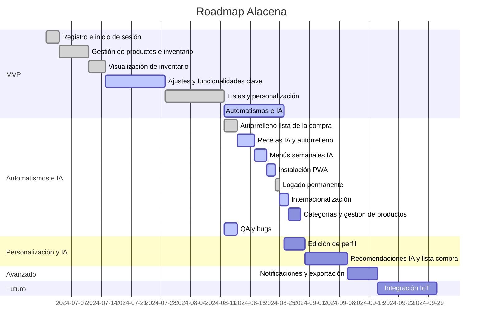

# Planificación de Releases y Roadmap

## Estado Actual (2024-07-18)
- [x] 14 historias del MVP completadas
- [ ] 5 historias del MVP pendientes
- [x] Refactor global de agentes IA, autenticación y UI completado
- [x] Logado permanente y autorrelleno de lista implementados
- [x] Traducciones corregidas y desplegadas

## Sprints y asignación de historias

| Sprint   | Historias                                                                                 | Estado |
|----------|------------------------------------------------------------------------------------------|---------|
| Sprint 1 | HU_1 (S/S/S), HU_2 (S/S/S), HU_3 (M/M/S), HU_4 (M/S/S), HU_5 (S/S/S), HU_12 (M/S/S)   | ✅ Completado excepto HU_12 |
| Sprint 2 | HU_13 (S/S/S), HU_14 (M/M/S), HU_15 (S/S/S), HU_16 (S/S/S), HU_17 (M/S/S), HU_18 (S/S/S), HU_19 (S/S/S) | ✅ Completado |
| Sprint 3 | HU_23 (S/M/S), HU_24 (S/M/S), HU_25 (M/M/S), HU_22 (S/S/S), HU_20 (S/S/S), HU_21 (M/S/S)  | 🔄 En progreso |

(Las tallas corresponden a FE/BE/QA)

## Release 1: MVP - Gestión Básica y Ajustes Clave ✅
- [x] HU_1: Registro de usuario *(MVP)*
- [x] HU_2: Inicio de sesión *(MVP)*
- [x] HU_3: Gestión de productos en la alacena *(MVP)*
- [x] HU_4: Visualización de inventario *(MVP)*
- [x] HU_5: Añadir y quitar productos del inventario *(MVP)*
- [ ] HU_12: Ajuste y coherencia del layout base *(MVP)* - En progreso
- [x] HU_13: Lista de la compra obligatoria e inicial *(MVP)*
- [x] HU_14: Listas personalizables y compartibles *(MVP)*
- [x] HU_15: Iconos y categorías en productos *(MVP)*
- [x] HU_16: Alertas y visualización avanzada de caducidades *(MVP)*
- [x] HU_17: Mover productos entre listas *(MVP)*
- [x] HU_18: Edición rápida de productos (+ y -) *(MVP)*
- [x] HU_19: Botón de eliminar producto visible *(MVP)*
- [x] HU_20: Logado permanente *(MVP)*
- [ ] HU_21: Selector de idioma y estilo personalizable *(MVP)* - Traducciones completadas
- [ ] HU_22: Instalación PWA *(MVP)*
- [x] HU_23: Autorrelleno automático de la lista de la compra *(MVP)*
- [ ] HU_24: Recetas IA y autorrelleno de lista de la compra *(MVP)*
- [ ] HU_25: Menús semanales con IA y comidas fuera *(MVP)*

## Release 2: Personalización y Planificación Inteligente 🔄
- HU_6: Edición de perfil de usuario *(Mock/Parcial en MVP, completo aquí)*
- HU_7: Recomendaciones de IA para menús *(Mock/Parcial en MVP, completo aquí)*
- HU_8: Generación automática de lista de la compra *(Mock/Parcial en MVP, completo aquí)*

## Release 3: Funcionalidades Avanzadas ⏳
- HU_9: Personalización de notificaciones *(Mock/Parcial en MVP, completo aquí)*
- HU_10: Exportar datos de la alacena *(Mock/Parcial en MVP, completo aquí)*

## Release 4: Integración y Automatización ⏳
- HU_11: Integración con dispositivos IoT *(Solo endpoint/documentación en MVP, completo aquí)*

## Próxima Release

- **Historia de usuario: Edición y eliminación de categorías (HU_26)**
  - Como usuario quiero poder editar y eliminar categorías para mantener mi lista de categorías organizada y actualizada.
  - **Criterios de aceptación:**
    - El usuario puede editar el nombre y el icono de una categoría existente.
    - El usuario puede eliminar una categoría, con advertencia si tiene productos asociados.
    - No se permite eliminar la categoría "Sin categoría".
    - Los productos afectados se actualizan automáticamente.
    - Feedback visual de éxito o error.
  - **Tareas técnicas:**
    - Crear panel/listado de categorías con opciones de editar y eliminar.
    - Implementar eventos y lógica para editar/eliminar categorías en backend y frontend.
    - Gestionar actualización reactiva de productos afectados.
    - Añadir tests para edición y eliminación de categorías.

---

## Roadmap Visual

| Estado      | Historias                                                                                                   |
|-------------|------------------------------------------------------------------------------------------------------------|
| Por hacer   | HU_24, HU_25, HU_22, HU_21 (parcial), HU_26                                                                |
| En progreso | HU_12                                                                                                       |
| Hecho       | HU_1, HU_2, HU_3, HU_4, HU_5, HU_13, HU_14, HU_15, HU_16, HU_17, HU_18, HU_19, HU_20, HU_23             |

> [2024-07-18] Hito: Refactor global de agentes IA, orquestador, autenticación y UI. Listo para abordar automatismos, IA avanzada y logado permanente.

---

**Planificación y prioridades (reunión 2024-07-18):**
1. Completar integración de agentes IA (HU_24, HU_25)
2. Implementar PWA y funcionalidad offline (HU_22)
3. Finalizar selector de estilo (HU_21)
4. Implementar edición y eliminación de categorías (HU_26)
5. Completar pruebas de integración y QA

Se mantiene un 20% del tiempo de sprint para revisión de bugs y corrección de funcionalidad actual.
