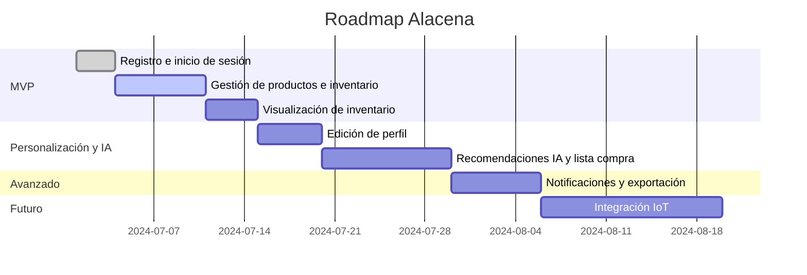

# Planificación de Releases y Roadmap

## Release 1: MVP - Gestión Básica de Alacena (≤30h)
- HU_1: Registro de usuario *(MVP)*
- HU_2: Inicio de sesión *(MVP)*
- HU_3: Gestión de productos en la alacena *(MVP)*
- HU_4: Visualización de inventario *(MVP)*
- HU_5: Añadir y quitar productos del inventario *(MVP)*

## Release 2: Personalización y Planificación Inteligente
- HU_6: Edición de perfil de usuario *(Mock/Parcial en MVP, completo aquí)*
- HU_7: Recomendaciones de IA para menús *(Mock/Parcial en MVP, completo aquí)*
- HU_8: Generación automática de lista de la compra *(Mock/Parcial en MVP, completo aquí)*

## Release 3: Funcionalidades Avanzadas
- HU_9: Personalización de notificaciones *(Mock/Parcial en MVP, completo aquí)*
- HU_10: Exportar datos de la alacena *(Mock/Parcial en MVP, completo aquí)*

## Release 4: Integración y Automatización
- HU_11: Integración con dispositivos IoT *(Solo endpoint/documentación en MVP, completo aquí)*

---

## Roadmap Visual

