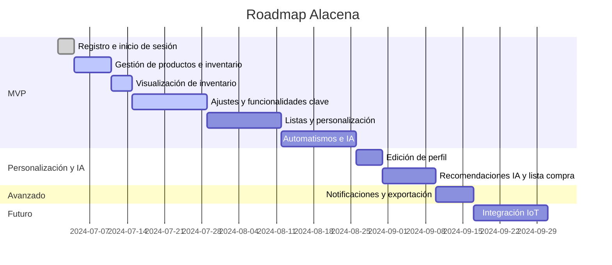

# Planificación de Releases y Roadmap

## Sprints y asignación de historias

| Sprint   | Historias                                                                                 |
|----------|------------------------------------------------------------------------------------------|
| Sprint 1 | HU_1 (S/S/S), HU_2 (S/S/S), HU_3 (M/M/S), HU_4 (M/S/S), HU_5 (S/S/S), HU_12 (M/S/S)       |
| Sprint 2 | HU_13 (S/S/S), HU_14 (M/M/S), HU_15 (S/S/S), HU_16 (S/S/S), HU_17 (M/S/S), HU_18 (S/S/S), HU_19 (S/S/S) |
| Sprint 3 | HU_20 (S/S/S), HU_21 (M/S/S), HU_22 (S/S/S), HU_23 (S/M/S), HU_24 (S/M/S), HU_25 (M/M/S)  |

(Las tallas corresponden a FE/BE/QA)

## Release 1: MVP - Gestión Básica y Ajustes Clave
- HU_1: Registro de usuario *(MVP)*
- HU_2: Inicio de sesión *(MVP)*
- HU_3: Gestión de productos en la alacena *(MVP)*
- HU_4: Visualización de inventario *(MVP)*
- HU_5: Añadir y quitar productos del inventario *(MVP)*
- HU_12: Ajuste y coherencia del layout base *(MVP)*
- HU_13: Lista de la compra obligatoria e inicial *(MVP)*
- HU_14: Listas personalizables y compartibles *(MVP)*
- HU_15: Iconos y categorías en productos *(MVP)*
- HU_16: Alertas y visualización avanzada de caducidades *(MVP)*
- HU_17: Mover productos entre listas *(MVP)*
- HU_18: Edición rápida de productos (+ y -) *(MVP)*
- HU_19: Botón de eliminar producto visible *(MVP)*
- HU_20: Logado permanente *(MVP)*
- HU_21: Selector de idioma y estilo personalizable *(MVP)*
- HU_22: Instalación PWA *(MVP)*
- HU_23: Autorrelleno automático de la lista de la compra *(MVP)*
- HU_24: Recetas IA y autorrelleno de lista de la compra *(MVP)*
- HU_25: Menús semanales con IA y comidas fuera *(MVP)*

## Release 2: Personalización y Planificación Inteligente
- HU_6: Edición de perfil de usuario *(Mock/Parcial en MVP, completo aquí)*
- HU_7: Recomendaciones de IA para menús *(Mock/Parcial en MVP, completo aquí)*
- HU_8: Generación automática de lista de la compra *(Mock/Parcial en MVP, completo aquí)*

## Release 3: Funcionalidades Avanzadas
- HU_9: Personalización de notificaciones *(Mock/Parcial en MVP, completo aquí)*
- HU_10: Exportar datos de la alacena *(Mock/Parcial en MVP, completo aquí)*

## Release 4: Integración y Automatización
- HU_11: Integración con dispositivos IoT *(Solo endpoint/documentación en MVP, completo aquí)*

## Próxima Release

- **Historia de usuario: Edición y eliminación de categorías**
  - Como usuario quiero poder editar y eliminar categorías para mantener mi lista de categorías organizada y actualizada.
  - **Criterios de aceptación:**
    - El usuario puede editar el nombre y el icono de una categoría existente.
    - El usuario puede eliminar una categoría, con advertencia si tiene productos asociados.
    - No se permite eliminar la categoría "Sin categoría".
    - Los productos afectados se actualizan automáticamente.
    - Feedback visual de éxito o error.
  - **Tareas técnicas:**
    - Crear panel/listado de categorías con opciones de editar y eliminar.
    - Implementar eventos y lógica para editar/eliminar categorías en backend y frontend.
    - Gestionar actualización reactiva de productos afectados.
    - Añadir tests para edición y eliminación de categorías.

---

## Roadmap Visual

```markdown
| Estado      | Historia/Ticket                                      |
|-------------|------------------------------------------------------|
| Por hacer   | HU_13, HU_14, HU_15, HU_16, HU_17, HU_18, HU_19, HU_20, HU_21, HU_22, HU_23, HU_24, HU_25 |
| En progreso | HU_12                                          |
| Hecho       | HU_1, HU_2, HU_3, HU_4, HU_5                               |
```


