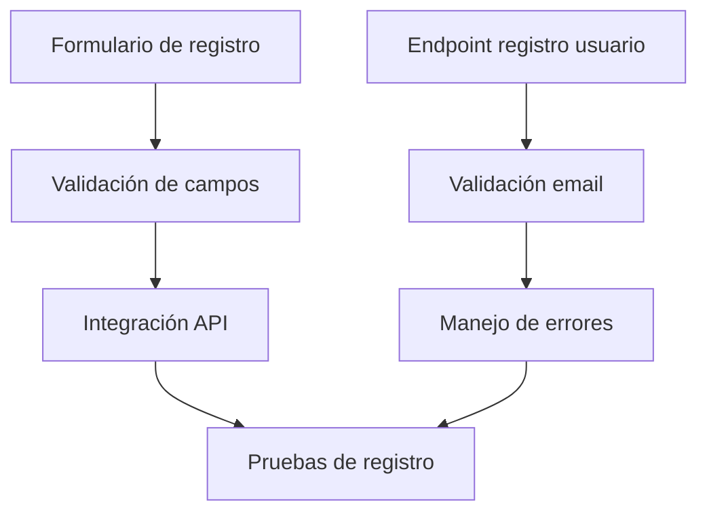

Título de la Historia de Usuario:
Registro de usuario

Como usuario nuevo,
quiero registrarme en la aplicación,
para que pueda gestionar mi alacena de forma personalizada.

Criterios de Aceptación:
- El usuario puede introducir nombre, email y contraseña.
- El sistema valida que el email no esté registrado.
- El usuario recibe confirmación de registro exitoso.

Notas Adicionales:
- El registro debe ser sencillo y accesible desde la pantalla principal.

Historias de Usuario Relacionadas:
- HU_2 (Inicio de sesión)

---

## Desglose Técnico y Estimación de Tickets

### Frontend (Python (PyScript/Anvil))
- **Implementar formulario de registro de usuario**
  _Talla de camiseta: S_
- **Validación de campos y mensajes de error**
  _Talla de camiseta: S_
- **Integración con API de registro**
  _Talla de camiseta: S_

### Backend (FastAPI)
- **Endpoint de registro de usuario (POST /usuarios)**
  _Talla de camiseta: M_
- **Validación de unicidad de email y lógica de negocio**
  _Talla de camiseta: S_
- **Envío de respuesta y manejo de errores**
  _Talla de camiseta: S_

### QA/Testing
- **Pruebas unitarias y de integración para el registro**
  _Talla de camiseta: S_

---

