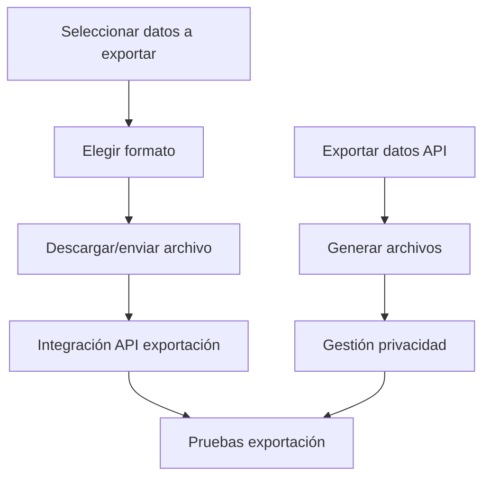

Título de la Historia de Usuario:
Exportar datos de la alacena

Como usuario autenticado,
quiero poder exportar los datos de mi alacena,
para que pueda realizar copias de seguridad o analizar mi inventario en otras aplicaciones.

Criterios de Aceptación:
- El usuario puede exportar los datos en formatos estándar (CSV, PDF, etc.).
- El usuario puede seleccionar qué información exportar (productos, movimientos, listas de la compra).
- El sistema genera el archivo y permite su descarga o envío por email.

Notas Adicionales:
- La opción de exportar debe estar disponible desde la sección de configuración o inventario.
- Debe garantizarse la privacidad y seguridad de los datos exportados.

Historias de Usuario Relacionadas:
- HU_3 (Gestión de productos en la alacena)
- HU_8 (Generación automática de lista de la compra)

---

## Desglose Técnico y Estimación de Tickets

### Frontend (Python (PyScript/Anvil))
- Implementar interfaz para seleccionar datos a exportar
  _Talla de camiseta: S_
- Opción para elegir formato de exportación (CSV, PDF, etc.)
  _Talla de camiseta: S_
- Visualización y descarga/envío del archivo generado
  _Talla de camiseta: S_
- Integración con API de exportación
  _Talla de camiseta: S_

### Backend (FastAPI)
- Endpoint para exportar datos seleccionados (GET /exportar)
  _Talla de camiseta: M_
- Lógica para generar archivos en diferentes formatos
  _Talla de camiseta: M_
- Gestión de privacidad y seguridad en la exportación
  _Talla de camiseta: S_

### QA/Testing
- Pruebas unitarias y de integración para exportación de datos
  _Talla de camiseta: S_

---

