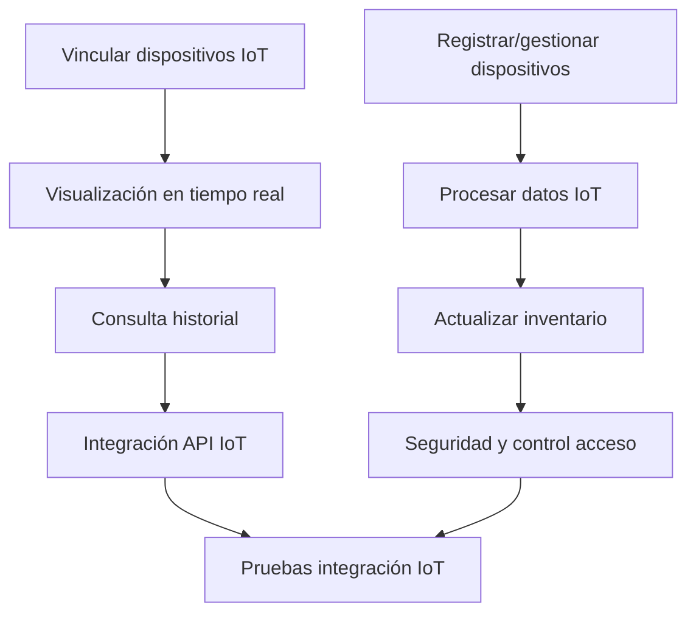

Título de la Historia de Usuario:
Integración con dispositivos IoT

Como usuario avanzado,
quiero integrar la aplicación con dispositivos IoT compatibles (como balanzas inteligentes o sensores de despensa),
para que la actualización del inventario sea automática y más precisa.

Criterios de Aceptación:
- El usuario puede vincular dispositivos IoT soportados desde la configuración.
- El sistema recibe y procesa datos automáticamente desde los dispositivos conectados.
- Los cambios en el inventario se reflejan en tiempo real según los datos recibidos.
- El usuario puede consultar el historial de actualizaciones automáticas.

Notas Adicionales:
- La integración debe ser segura y respetar la privacidad del usuario.
- Debe existir soporte para añadir nuevos dispositivos en el futuro.

Historias de Usuario Relacionadas:
- HU_3 (Gestión de productos en la alacena)
- HU_5 (Añadir y quitar productos del inventario)

---

## Desglose Técnico y Estimación de Tickets

### Frontend (Python (PyScript/Anvil))
- Implementar interfaz para vinculación y gestión de dispositivos IoT
  _Talla de camiseta: M_
- Visualización en tiempo real de actualizaciones de inventario
  _Talla de camiseta: M_
- Consulta del historial de actualizaciones automáticas
  _Talla de camiseta: S_

### Backend (FastAPI)
- Endpoint para registrar y gestionar dispositivos IoT (POST/GET /iot/dispositivos)
  _Talla de camiseta: L_
- Recepción y procesamiento de datos desde dispositivos IoT
  _Talla de camiseta: L_
- Actualización automática del inventario y registro de historial
  _Talla de camiseta: M_
- Seguridad y control de acceso para integración IoT
  _Talla de camiseta: M_

### QA/Testing
- Pruebas de integración y simulación de dispositivos IoT
  _Talla de camiseta: M_

---

