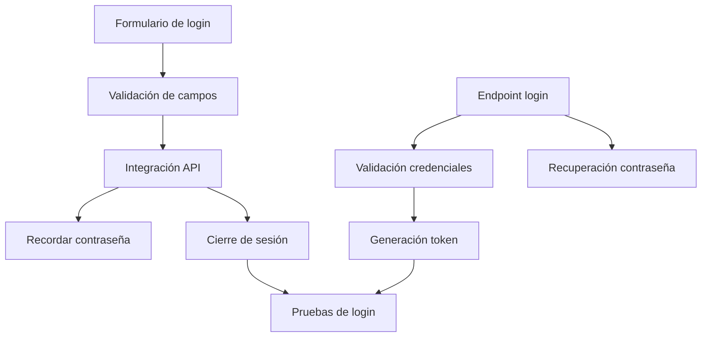

Título de la Historia de Usuario:
Inicio de sesión

Como usuario registrado,
quiero iniciar sesión en la aplicación,
para que pueda acceder de forma segura a mi alacena y datos personales.

Criterios de Aceptación:
- El usuario puede introducir email y contraseña.
- El sistema valida las credenciales y permite el acceso si son correctas.
- Si las credenciales son incorrectas, se muestra un mensaje de error claro.
- La sesión es persistente y segura (token JWT de Supabase).
- El usuario puede cerrar sesión en cualquier momento.

Notas Adicionales:
- El login social (Google) es opcional y se implementará en releases posteriores.
- Debe existir opción de recordar contraseña (mock en MVP).
- El inicio de sesión debe ser rápido y seguro.
- **Esta historia entra en el MVP.**

Historias de Usuario Relacionadas:
- HU_1 (Registro de usuario)
- HU_6 (Edición de perfil de usuario)

---

## Desglose Técnico y Estimación de Tickets

### Frontend (Python (PyScript/Anvil))
- [X] Implementar formulario de inicio de sesión
  _Talla de camiseta: S_
- [X] Validación de campos y mensajes de error
  _Talla de camiseta: S_
- [X] Integración con API de autenticación
  _Talla de camiseta: S_
- [X] Implementar funcionalidad de "recordar contraseña" (mock MVP)
  _Talla de camiseta: S_
- [X] Implementar cierre de sesión
  _Talla de camiseta: S_

### Backend (FastAPI)
- [X] Endpoint de autenticación de usuario (POST /login)
  _Talla de camiseta: M_
- [X] Lógica de validación de credenciales y generación de token JWT
  _Talla de camiseta: M_
- [X] Endpoint para recuperación de contraseña (mock MVP)
  _Talla de camiseta: M_
- [X] Endpoint para cierre de sesión (opcional, invalidación de token)
  _Talla de camiseta: S_

### QA/Testing
- [X] Pruebas unitarias y de integración para el inicio de sesión
  _Talla de camiseta: S_
- [X] Automatización de tests y calidad en pre-commit
  _Talla de camiseta: S_
- [X] Validación de casos de error y edge cases en login/logout
  _Talla de camiseta: S_

---

**Avances implementados:**
- El inicio de sesión está completamente funcional e integrado con Supabase Auth.
- El formulario de login valida credenciales y muestra mensajes de error claros.
- El cierre de sesión y la persistencia de sesión funcionan correctamente.
- Se han cubierto los casos de error más comunes (credenciales incorrectas, usuario no existente, etc.).
- Los tests unitarios y de integración pasan correctamente y están automatizados en el flujo de calidad.

---
