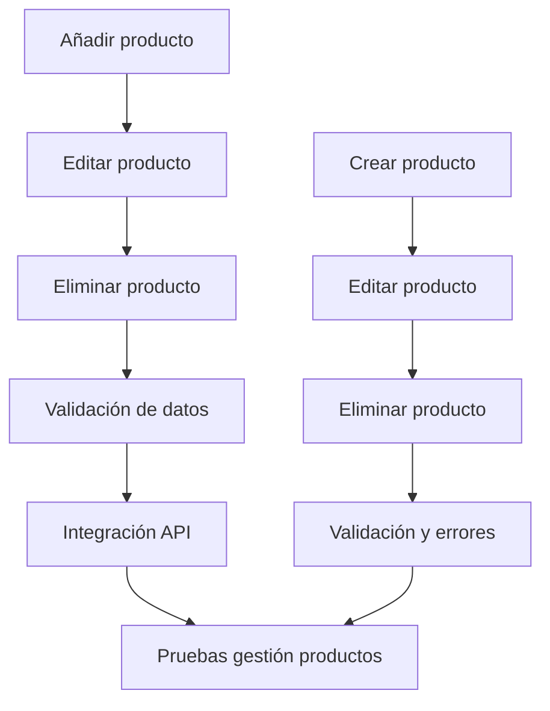

Título de la Historia de Usuario:
Gestión de productos en la alacena

Como usuario autenticado,
quiero poder añadir, editar y eliminar productos en mi alacena,
para que pueda mantener actualizado el inventario de mi despensa.

Criterios de Aceptación:
- El usuario puede añadir un nuevo producto indicando nombre, cantidad y fecha de caducidad.
- El usuario puede editar los datos de un producto existente.
- El usuario puede eliminar productos de la alacena.
- El sistema valida los datos introducidos y muestra mensajes claros en caso de error.

Notas Adicionales:
- La gestión debe ser intuitiva y accesible desde la pantalla principal.
- Debe existir confirmación antes de eliminar un producto.

Historias de Usuario Relacionadas:
- HU_4 (Visualización de inventario)
- HU_5 (Añadir/quitar productos)

---

## Desglose Técnico y Estimación de Tickets

### Frontend (Python (PyScript/Anvil))
- Implementar interfaz para añadir productos
  _Talla de camiseta: S_
- Implementar interfaz para editar productos
  _Talla de camiseta: S_
- Implementar interfaz para eliminar productos
  _Talla de camiseta: S_
- Validación de datos y mensajes de error
  _Talla de camiseta: S_
- Integración con API de productos
  _Talla de camiseta: S_

### Backend (FastAPI)
- Endpoint para crear producto (POST /productos)
  _Talla de camiseta: M_
- Endpoint para editar producto (PUT /productos/{id})
  _Talla de camiseta: M_
- Endpoint para eliminar producto (DELETE /productos/{id})
  _Talla de camiseta: M_
- Validación de datos y manejo de errores
  _Talla de camiseta: S_

### QA/Testing
- Pruebas unitarias y de integración para gestión de productos
  _Talla de camiseta: S_

---

