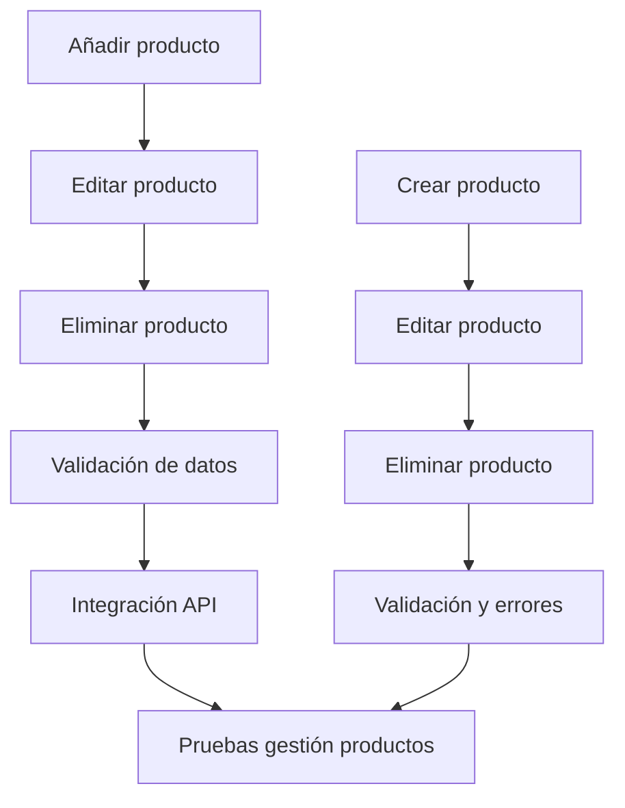

Título de la Historia de Usuario:
Gestión de productos en la alacena

Como usuario autenticado,
quiero poder añadir, editar y eliminar productos en mi alacena,
para que pueda mantener actualizado el inventario de mi despensa.

Criterios de Aceptación:
- El usuario puede añadir, editar y eliminar productos (CRUD completo).
- El usuario introduce nombre, cantidad, unidad y fecha de caducidad.
- El sistema valida los datos introducidos y muestra mensajes claros en caso de error.
- Los cambios se reflejan en tiempo real (Supabase Realtime).
- Solo se gestionan productos del usuario autenticado (RLS en Supabase).

Notas Adicionales:
- La gestión debe ser intuitiva y accesible desde la pantalla principal.
- Debe existir confirmación antes de eliminar un producto.
- Gestión avanzada (categorías, unidades personalizadas) se implementará en releases posteriores.
- **Esta historia entra en el MVP.**

Historias de Usuario Relacionadas:
- HU_4 (Visualización de inventario)
- HU_5 (Añadir/quitar productos)

---

## Desglose Técnico y Estimación de Tickets

### Frontend (Python (PyScript/Anvil))
- Implementar interfaz para añadir productos
  _Talla de camiseta: S_
- Implementar interfaz para editar productos
  _Talla de camiseta: S_
- Implementar interfaz para eliminar productos
  _Talla de camiseta: S_
- Validación de datos y mensajes de error
  _Talla de camiseta: S_
- Integración con API de productos
  _Talla de camiseta: S_

### Backend (FastAPI)
- Endpoint para crear producto (POST /productos)
  _Talla de camiseta: M_
- Endpoint para editar producto (PUT /productos/{id})
  _Talla de camiseta: M_
- Endpoint para eliminar producto (DELETE /productos/{id})
  _Talla de camiseta: M_
- Validación de datos y manejo de errores
  _Talla de camiseta: S_

### QA/Testing
- Pruebas unitarias y de integración para gestión de productos
  _Talla de camiseta: S_

---

---

## Plan de trabajo y tickets (Sprint actual)

### 1. Frontend & Diseño (Prioridad máxima)
- [X] Prototipo visual de la gestión de productos (listado, formulario de alta/edición, confirmación de borrado) usando TailwindCSS.
- [X] Validación de formularios y feedback de errores en la UI.
- [ ] Resaltado visual para productos próximos a caducar.
- [X] Accesibilidad y responsive desde el primer momento.
- [X] Revisión y validación rápida con el equipo.

### 2. Backend & DevOps
- [ ] Definir el modelo de datos `Producto` en Supabase (campos: id, nombre, cantidad, unidad, fecha_caducidad, usuario_id).
- [ ] Configurar RLS para que cada usuario solo acceda a sus productos.
- [ ] Crear endpoints básicos (CRUD) en FastAPI/Supabase.
- [ ] Validación de datos y control de errores en la API.
- [ ] Soporte para eventos en tiempo real (opcional en MVP, recomendable).

### 3. Integración Frontend-Backend
- [ ] Conectar la UI con los endpoints reales.
- [X] Pruebas de flujo completo: alta, edición, borrado y visualización de productos.
- [ ] Feedback de errores y confirmaciones en la app.

---

> **Nota:** El equipo trabajará en paralelo en frontend/diseño y backend/devops, priorizando la entrega temprana de la parte visual para revisión y testeo rápido. La integración se realizará en cuanto los endpoints estén disponibles.
